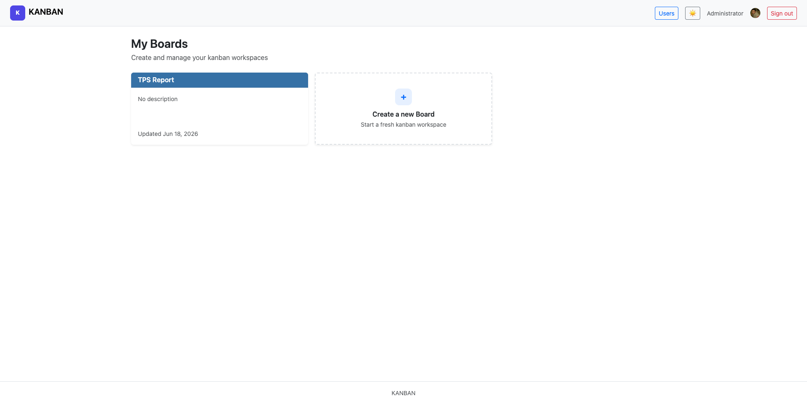
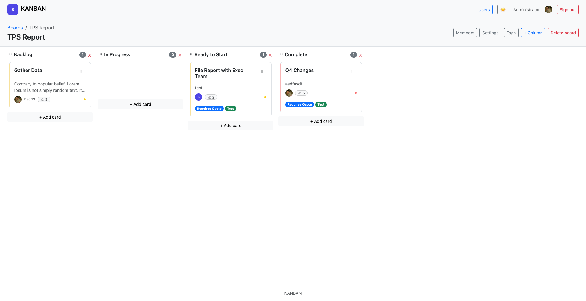
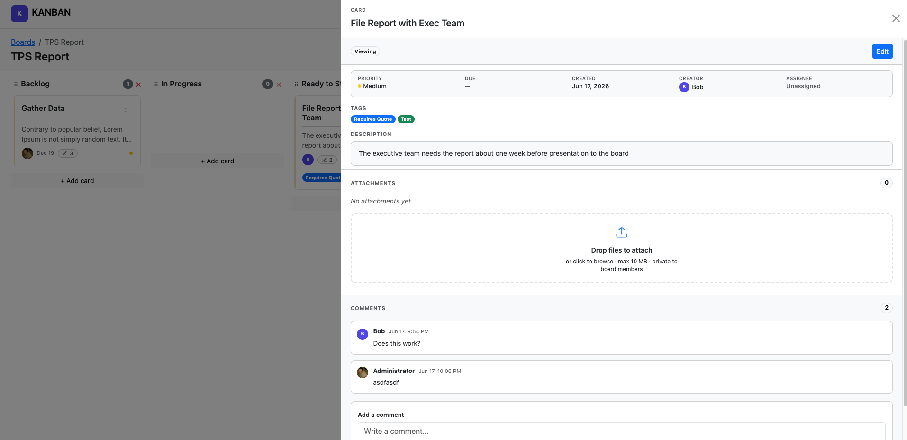
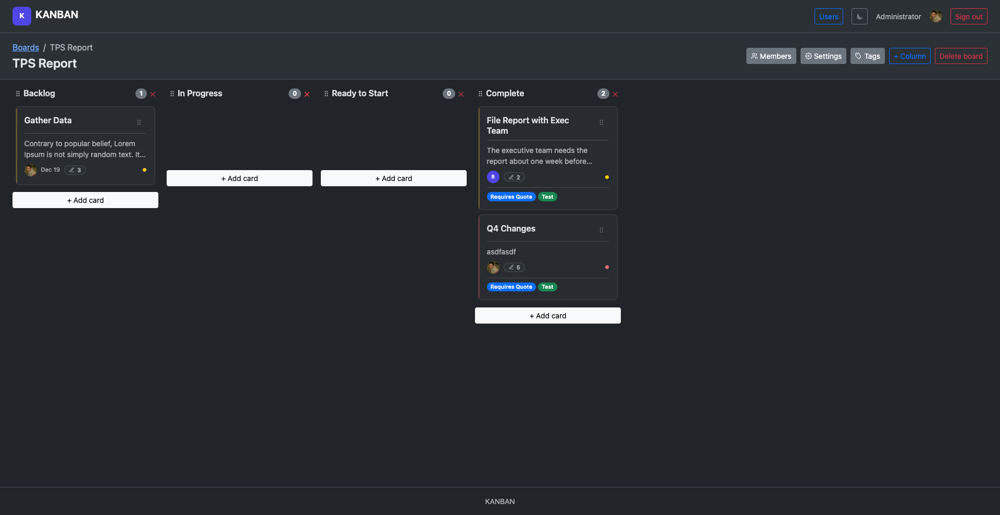
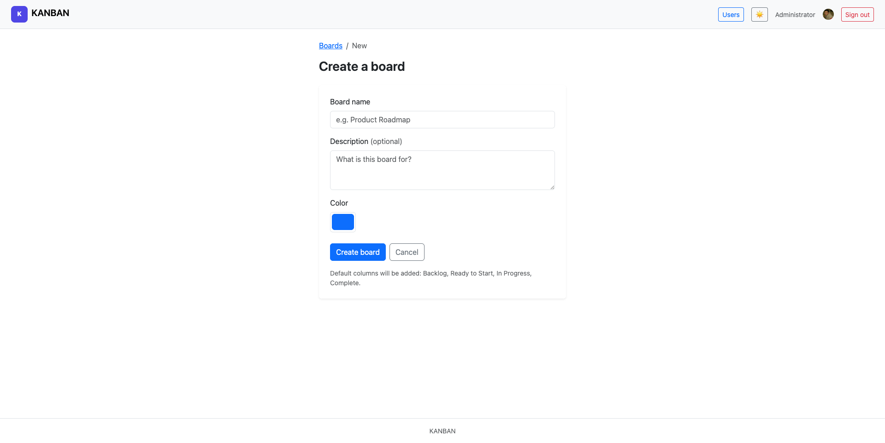
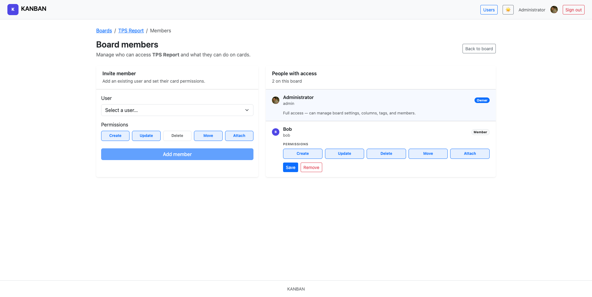

# Kanban Board

A self-hosted kanban app with drag-and-drop cards, board permissions, card attachments, and a per-user **light/dark theme** that follows you across sessions.

## Quick start

### 1. Configure

Copy `config.example.json` to `config.json` in one of these locations (checked in this order):

1. `/etc/kanban/config.json` — system-wide
2. `$HOME/.kanban/config.json` — per-user
3. `./config.json` — current working directory

For local development, the working directory is simplest:

```bash
cp config.example.json config.json
```

Edit `config.json`:

- Set `session_secret` to a long random string.
- Optionally set Google OAuth credentials under `auth.google`.
- Optionally customize branding (`app_name`, `brand_mark`, `brand_color`).

### 2. Build

The default SQLite driver is pure Go — **no CGO required**. Builds work with `CGO_ENABLED=0` (static binaries, cross-compilation, and CI):

```bash
CGO_ENABLED=0 go build -o kanban .
```

A plain `go build` also works on machines where CGO happens to be enabled; SQLite does not depend on it.

Cross-compile example:

```bash
CGO_ENABLED=0 GOOS=linux GOARCH=amd64 go build -o kanban .
```

### 3. Create an admin user

```bash
./kanban bootstrap-admin -username admin -email admin@example.com -password 'your-secure-password'
```

If an admin already exists, add `--update` to replace credentials:

```bash
./kanban bootstrap-admin -username admin -email you@example.com -password 'secret' -name 'Your Name' --update
```

Omit `-password` to generate a random password printed once.

### 4. Run

```bash
./kanban
```

Open [http://localhost:8080](http://localhost:8080) and sign in with your local account or Google.

## Usage

1. **Boards** — From the home screen, open a board or use **Create a new Board** to start a workspace.
2. **Columns** — Boards ship with Backlog, Ready to Start, In Progress, and Complete. Owners can add columns from the board toolbar.
3. **Cards** — Click **+ Add card** in a column. Drag cards by the handle on the right. Click a card to open the detail panel.
4. **Card details** — Edit title, description, tags, priority, due date, and assignee. Add comments and drop files into the attachment zone.
5. **Board admin** — Owners use **Members**, **Settings**, and **Tags** in the board header to manage access, board color/name, and tag pills.
6. **Theme** — Use the sun/moon toggle in the navbar to switch light or dark mode. Your choice is saved to your user account.

## Screenshots

Most screenshots below are in light mode. Use the sun/moon toggle in the navbar to switch themes — your preference is saved to your account.

### My boards



### Kanban board



### Card detail panel



### Dark mode



### Create board



### Board settings



## Features

- **Authentication** — Local username/password and optional Google OAuth; CSRF on all POST forms
- **Access control** — Users see boards they own or are members of; admins see all boards
- **Member permissions** — Per-user toggles for create, update, delete, move, and attach on cards
- **Boards & columns** — Multiple boards; customizable columns and board color
- **Cards** — Title, description, tags, priority, due date, assignee, creator, and comments
- **Attachments** — Drag-and-drop files on cards; stored privately and served only to authorized users
- **Light/dark theme** — Navbar toggle; preference saved to your user profile (also cached in the browser for fast loads)
- **Branding** — Configurable app name, header mark, and brand color

## Configuration

`config.json` is loaded from the first location that exists:

| Priority | Path |
|----------|------|
| 1 | `/etc/kanban/config.json` |
| 2 | `$HOME/.kanban/config.json` |
| 3 | `./config.json` (working directory) |

See `config.example.json` for all options. Database driver can be `sqlite`, `mysql`, or `postgres`.

SQLite uses [glebarez/sqlite](https://github.com/glebarez/sqlite) (`modernc.org/sqlite`), a pure Go implementation. You do not need a C compiler or `libsqlite3` on the host.

**Branding** example:

```json
"branding": {
  "app_name": "My Team Boards",
  "brand_mark": "TB",
  "brand_color": "#4f46e5"
}
```

`brand_mark` is the letter(s) in the colored navbar icon; `brand_color` is its hex background; `app_name` appears in the navbar, titles, footer, and login screen.

**Attachments** are stored outside the web root (default `data/attachments/`). Override with `attachments_dir` in config.

## Authentication notes

- **Google OAuth** — Only signs in users who already have an account; it does not auto-create users.
- **Bootstrap admin** — `./kanban bootstrap-admin` creates the first local admin.

## Stack

- **Go** with `net/http` ServeMux (**CGO not required**; build with `CGO_ENABLED=0`)
- **GORM** + pure Go **SQLite** (`glebarez/sqlite`; MySQL/PostgreSQL also supported)
- **Goth** (Google OAuth)
- **vhelp** (JSON configuration)
- **Bootstrap 5** + **Hotwire Turbo** + **SortableJS**
